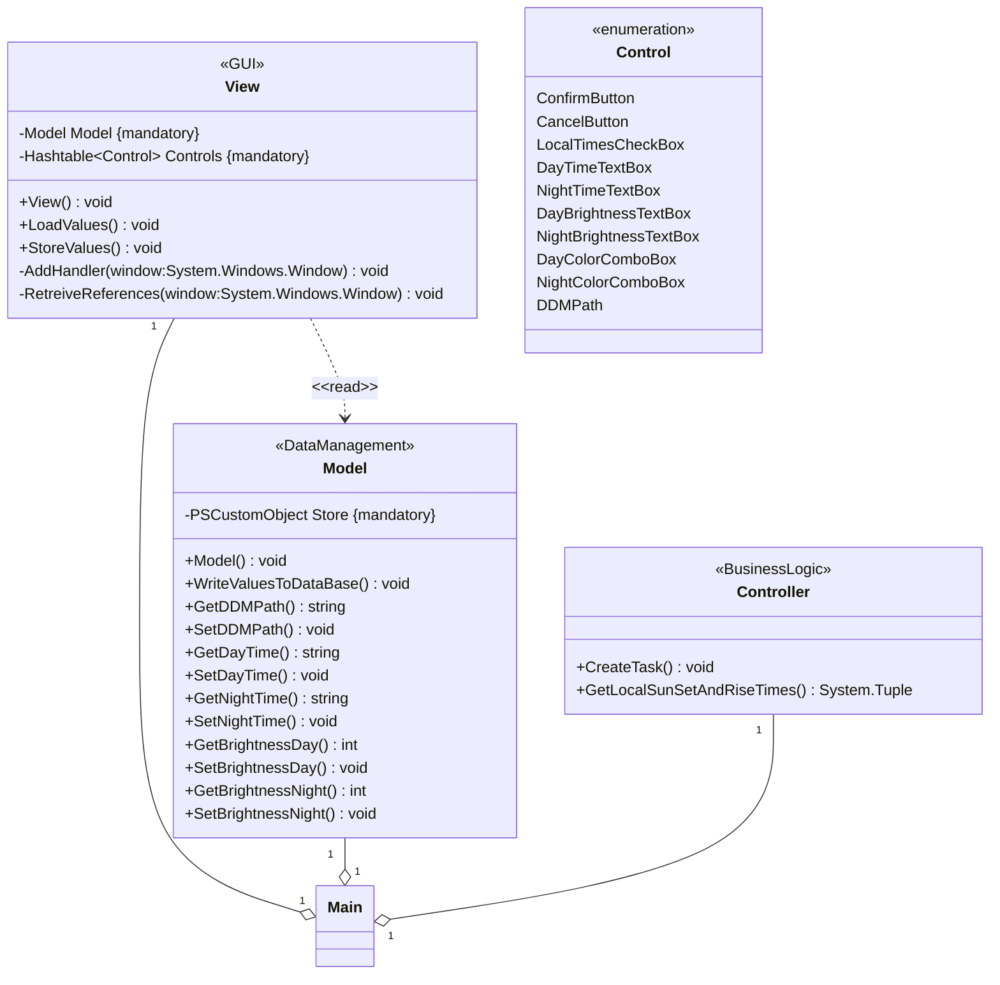
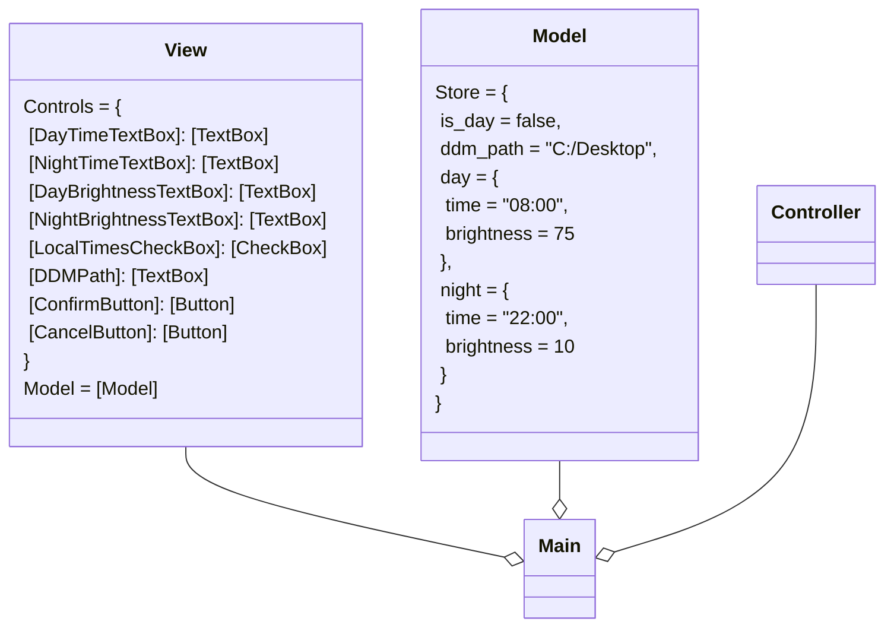
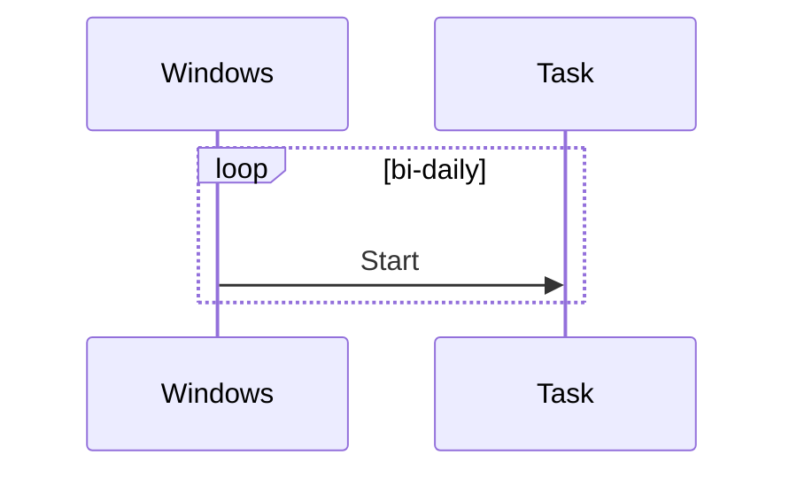

<h1 style="color: Grey">🌜 Dell-Night-Light</h1>

Dell Night Light is a tool with wich one can schedule brightness and color temperature changes of ones Dell display.

## Usage

Checkout repository. Open command line in /src folder and call with 

```
> PowerShell ./Main.ps1
```

## 1. Requirements analysis 

### User Stories

> As a User, i want my monitor to automatically adjust brightness whenever it gets dark, so that i don't have to myself.

>As a User, i want my computer so spear my eyes with warm colors, when the sun has set.


### Requirements

#### Functional requirements

- The program must save the brightness level and color temperature as a state, in order to read it on the next start up.
- The program must have the ability to retreive local sun set and rise times based on the region code of the machine its running on.
- The program must be able to parse datetime input and be able to handle false input (-formats). It should show errors accordingly.
- The application should provide a intuitive graphical user interface, in order to be accessible to a large variety of users.

#### Non-functional requirements

- The input processing should not slow the application down nor interupt interaction flow.
- The user should be able to pick color temps from a expandable list.
- If the brightness of the display is set to below 25%, the application should present itself in dark mode.

<br>

## 2. Modelling

### Use Cases

---

Unfortunately mermaid doesn't support use-case diagrams, so here's a png generated with yEd graph editor.


### Classdiagram

---



### Objectdiagram

---



### State-diagram

---


### Sequencediagram

---




<br>

## 3. Implementation

---

This program was implemented with Powershell because of its communication capabilites with the Windows operating system and therefore with the Task Scheduler. 

Currently the user data is stored in a JSON file, alternatively it could be implemented with a DataBase like MySQL.

See source code in src subfolder. 

### Requirements

- Dell Display Manager executable
- Powershell
- assemblies: presentationframework, presentation

--- 

### TODO

- [ ] implement time adjustment lined up with local sun rise/set times
- [ ] add input validation (in xaml using validation rules)
- [ ] make setting of color temperature available
- [ ] make setting of windows theme available
